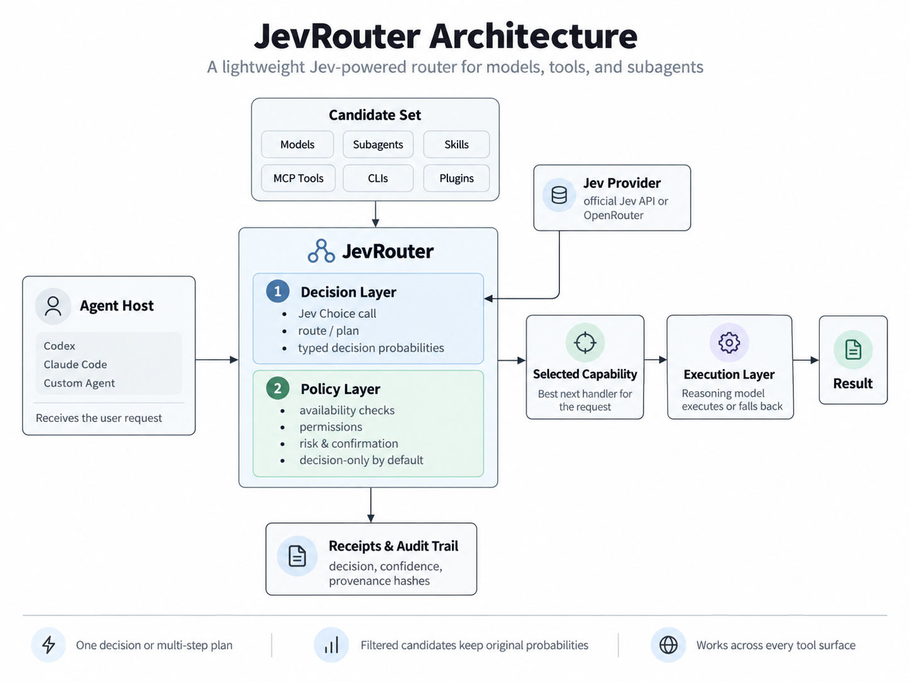

<div align="center">


# JevRouter

**Faster agent decisions.** Models, subagents, skills, MCP tools, CLIs and plugins become one candidate set — Jev answers one typed Choice question, JevRouter enforces availability, permissions, risk and confirmation around it.

[](https://github.com/BillionsBobby/JevRouter/actions/workflows/ci.yml)
[](https://www.jevrouter.co/)
[](LICENSE)
[](package.json)
[](tsconfig.json)
[](CONTRIBUTING.md)

[Website](https://www.jevrouter.co/) · [Quickstart](#quickstart) · [Benchmark](#benchmark) · [Cookbook](docs/cookbook/README.md) · [Documentation](#documentation) · [中文](#中文介绍)

</div>

---

## Why JevRouter

Agents waste reasoning tokens on a question a fast decision model answers better: **which capability should handle this next?** JevRouter puts [Jev](https://www.jevrouter.co/) — a System One model that turns structured state into typed decisions with probability distributions — in front of your tools, while your reasoning model stays the execution and fallback layer.

The key contract is simple: **Jev owns the decision probabilities; JevRouter owns availability, permissions, risk and confirmation.** Router fields live under `router`, while the original `probabilities`, `confidence`, and complete provider response remain intact. Filtered candidates are never re-normalized.

- **Decision-only by default** — nothing executes implicitly; medium/high/critical capabilities require confirmation.
- **One call or a plan** — `route` answers one question; `plan` answers "which capability handles step 1..N" with serial, batch, and decomposed strategies.
- **Every surface** — models, subagents, Skills, MCP tools, CLIs, DSH plugins share one routing contract.
- **Receipts by default** — append-only decision/plan files with provenance hashes; what was decided, why, and at what confidence is always auditable.
- **Capability trust is explicit** — discovered and caller-supplied candidates carry verification status; strict projects can set `require_verified_candidates` to prevent unverified descriptions from being selected.



## Benchmark

First-5 tool-call prediction on 10 Toolathlon tasks (real tool inventories from 9 live MCP servers, Jev `typesafe/jev-1.13-20260917` vs DeepSeek V4.1 Flash):

| Metric | Jev serial | Jev decompose + thread | DeepSeek V4.1 Flash |
|---|---|---|---|
| Position-wise hits | 38% | **44%** | 24% |
| Prefix alignment (mean LCP) | 0.9 | **1.6** | 0.5 |
| Latency per task | **1.58s** | 10.6s | 8.65s |
| Cost per 10 tasks | **$0.0058** | $0.0055 | ≈ $0.0407 |

Batch mode with beam sequence selection (`--sequence beam`) lifts position-wise hits 28% → 36% at **zero extra provider calls**. The same decompose+thread configuration scores 44% hits / 69% overlap on MCP-Atlas. This experiment measures ordered routing decisions, not end-to-end task completion; method and per-task data in [issue #2](https://github.com/BillionsBobby/JevRouter/issues/2), strategies in [PR #9](https://github.com/BillionsBobby/JevRouter/pull/9).

## Quickstart

Node.js 20+ required. JevRouter accepts either the official Jev API or an OpenRouter key. The key is entered interactively when no matching environment variable is already exported.

**Give your agent the router** (installs the Skill + project instructions, checks Jev, launches the host):

```bash
npx --yes github:BillionsBobby/JevRouter agent start --agent codex
```

Choose `typesafe` for the official Jev API or `openrouter` at the prompt, then paste the corresponding key. The key stays in the current process environment and is never written to project files. For Claude Code use `--agent claude`, and for Cursor use `--agent cursor`. To install without launching a host, export `TYPESAFE_API_KEY`, `JEV_API_KEY`, or `OPENROUTER_API_KEY` first and use `agent setup`; to verify later, use `agent doctor` (`--live` adds a small paid probe):

```bash
npx --yes github:BillionsBobby/JevRouter agent setup          # Skill + project instructions only
npx --yes github:BillionsBobby/JevRouter agent doctor --live  # configuration + connectivity check
```

**Route one decision** (no registry needed — pass candidates inline):

```bash
OPENROUTER_API_KEY="your-key" npx --yes github:BillionsBobby/JevRouter route --provider openrouter \
  --request "Find original sources before summarizing" \
  --candidates '[{"name":"search_web","description":"Find web sources"},{"name":"summarize","description":"Summarize existing sources"}]'
```

**Plan a multi-step task**:

```bash
OPENROUTER_API_KEY="your-key" npx --yes github:BillionsBobby/JevRouter plan --provider openrouter \
  --request "Search sources about Jev, summarize them, save to notes.md" \
  --candidates-file candidates.json --steps 3 --mode serial
```

**SDK**:

```bash
npm install github:BillionsBobby/JevRouter
```

```ts
import { route, plan } from "jevrouter";

const decision = await route({ request, candidates: agentTools });
const planResult = await plan({ request, candidates: agentTools }, { steps: 3, mode: "batch", sequence: "beam" });
```

Try everything offline with the labelled demo provider (`--provider demo`) — no key required.

## Cookbook

Task-oriented recipes, each with exact commands and expected output:

| Recipe | What it covers |
|---|---|
| [Route your first request](docs/cookbook/01-route-your-first-request.md) | CLI one-shot, inline candidates, exit codes, demo mode |
| [Multi-step plans](docs/cookbook/02-multi-step-plans.md) | serial vs batch vs decompose, beam sequences, strategies |
| [Use with Codex](docs/cookbook/03-use-with-codex.md) | `agent setup/start/doctor`, `$jevrouter` Skill, MCP option |
| [Use with Claude Code](docs/cookbook/04-use-with-claude-code.md) | same flow for Claude Code (`/jevrouter`) |
| [MCP adapter](docs/cookbook/05-mcp-adapter.md) | `serve-mcp` stdio server, `jev_route` tool, host MCP configs |
| [Custom candidates & discovery](docs/cookbook/06-custom-candidates.md) | manifest contract, OpenAI tool shapes, `discover` |
| [Policy, risk & confirmation](docs/cookbook/07-policy-and-confirmation.md) | `policy.json`, confidence gates, `no_decision`, permissions |
| [Offline, caching & receipts](docs/cookbook/08-offline-and-caching.md) | demo provider, cache control, provenance, receipts |
| [Local dashboard](docs/cookbook/09-local-dashboard.md) | read-only routing statistics and effect boundary |

## How it works

1. **Choose the model.** Route by capability, latency, cost, and context without rewriting your agent loop.
2. **Every tool surface.** Skill, MCP, or plugin — routed through the same Jev decision layer with permissions, risk, and confirmation intact.
3. **Choose the specialist.** Delegate research, coding, and focused work to the subagent built for the request.

Single decisions go through one Jev Choice call. When `single_stage_max_candidates` is exceeded, JevRouter keeps the coarse Top-K first, then asks Jev for a final Choice over the reduced set; both raw responses are preserved in `raw_jev_stages`.

## Multi-step plans

`route` answers one question. `plan` answers "which capability should handle step 1..N of this request?":

- **Serial** (default): one full routing decision per step; earlier selections are appended to the state so later steps are conditioned on the plan so far. Any candidate count.
- **Batch**: all step questions in a single provider call over the same candidate set — cheapest and fastest; bounded by `single_stage_max_candidates`.
- **Decompose**: split the request into ordered sub-goals (built-in `rule` splitter or an injected `DecomposeFn`, e.g. an LLM that sees the tool catalog), then route each sub-goal as a single-step decision.

Strategy knobs: `sequence: "beam"` + `diversity_penalty` (joint sequence search with a repetition penalty), `thread_context` (plan context in each decomposed step), `group_by` (hierarchical server/type routing), `state_detail: "targets"`, `plan_hint`. Every step remains a full routing decision with per-step policy, fallback and raw responses. Plans are append-only receipts in `.jevrouter/plans/`. Details and measurements: [cookbook #2](docs/cookbook/02-multi-step-plans.md).

## Local dashboard

The MVP dashboard reads `.jevrouter/decisions/` and `.jevrouter/plans/` locally. It makes no Jev request and uploads no data:

```bash
npx jevrouter dashboard
```

Open `http://127.0.0.1:8788` to see routing counts, status/source/provider breakdowns, latency percentiles, selected capabilities, plan steps, and recent decisions. Execution outcome is shown as **not collected** until the host writes execution feedback, so a selected capability is never presented as a completed task.

## Interfaces

| Interface | Entry | Notes |
|---|---|---|
| CLI | `route`, `plan`, `discover`, `decision show`, `serve`, `dashboard`, `agent` | stdout is one JSON object; exit 0 = selected, 2 = review/no-decision, 1 = error |
| SDK | `route()`, `plan()` | candidates inline or from the local registry |
| HTTP | `serve --port 8787` | `POST /route`, `GET /capabilities`, `GET /health` |
| MCP | `serve-mcp` | one `jev_route` tool for MCP-native agents; never executes implicitly |

`route --stdin` accepts a JSON `{request, context?, candidates, input?, actor_permissions?}` object; `--candidates`/`--candidates-file` take JSON/YAML arrays or `{candidates: [...]}`. The same inputs work for `plan`.

### Beyond Choice: Score, Noul, structured state

`evaluate()` answers a mixed batch of all three Jev primitives against one structured state in a single provider call:

```ts
import { evaluate, getChoiceAnswer, getScoreAnswer, getNoulAnswer } from "jevrouter";

const raw = await evaluate({
  state: { ticket: "Checkout page shows a blank screen after I click Pay.", customer_tier: "enterprise" },
  questions: {
    team: { type: "choice", instructions: "Which team owns this?", criteria: { payments: "Billing or checkout issues", frontend: "Rendering issues" } },
    urgency: { type: "score", instructions: "How urgent?", criteria: ["next release", "this week", "blocking revenue"] },
    is_bug: { type: "noul", instructions: "Is this a software defect?", criteria: { true: "Broken product behavior", false: "Question or feature request" } },
  },
}, { provider: "openrouter" });

getChoiceAnswer(raw, "team").choice;   // "payments"
getScoreAnswer(raw, "urgency").score;  // 2 (blocking revenue)
getNoulAnswer(raw, "is_bug").noul;     // 0.96
```

Details and more patterns: [Jev primitives](docs/jev-primitives.md).

## Manifest contract

```json
{
  "id": "github.issue.search",
  "name": "Search GitHub issues",
  "type": "mcp_tool",
  "description": "Search issues in a GitHub repository.",
  "input_schema": { "type": "object", "properties": { "query": { "type": "string" } } },
  "permissions": ["github.read"],
  "risk": { "level": "low", "categories": ["external_read"] },
  "availability": { "available": true },
  "execution": { "mode": "mcp", "target": "github", "dry_run": true },
  "policy": { "requires_confirmation": false }
}
```

Capability discovery accepts local Skill directories, MCP server configuration, CLI names, and DSH plugin manifests:

```bash
npm run dev -- discover --skills examples/skills --mcp examples/mcp.json --cli git,docker --dsh examples/dsh
```

Skill discovery reads `SKILL.md` frontmatter, CLI discovery only calls `<command> --help`, MCP discovery performs `initialize` and `tools/list`, and DSH discovery reads JSON manifests. Discovered capabilities are converted into manifests and written only when their destination does not already exist. Secrets stay in the child process environment and are not copied into manifests.

## Decision response

`route` returns:

- `decision.jev_choice`: the option Jev selected.
- `decision.candidates[].jev_probability`: the exact probability for that option from the provider response.
- `decision.candidates[].router`: availability, permission, risk, confirmation and filter explanation.
- `RouteInput.actor_permissions`: optional caller permissions; when supplied, a capability is filtered if any manifest permission is missing.
- `RouteInput.input`: optional tool arguments; when supplied, the selected manifest's JSON Schema subset is validated before returning a selection.
- `raw_jev`: the complete provider response, including the OpenRouter envelope when the compatibility adapter is used.
- `raw_jev_stages`: coarse and final provider responses when two-stage routing is active.
- `decision.candidates[].jev_stage`: `single`, `coarse`, or `final`.
- `provenance.candidate_snapshot_hash`: stable hash of the sorted candidate set.

When Jev selects a filtered candidate, the router can choose the highest-probability safe candidate, but records that fact in `fallback.reason` and keeps `jev_choice` unchanged. When confidence is below policy, the result is `no_decision` and `selected` is `null`.

## Security posture

- Decision-only is the only mode; no CLI, Skill, MCP or DSH action runs implicitly.
- Medium/high/critical capabilities require confirmation by default.
- Missing permissions, unavailable capabilities and disallowed risk levels are hard filters.
- An inline candidate (`{ name, description }`, no `id`) keeps any `risk`, `policy` and `permissions` it declares; only `verification`, `availability`, `execution` and `metadata` are decided by JevRouter, and supplying one of those prints a line on stderr naming it. An inline candidate that declares nothing is still `low` risk, as before.
- API keys are read from environment variables and never written to manifests or decision files.
- Candidate provenance is separate from Jev probability; an unverified description can be visible for review without being treated as a verified host capability.
- Decision files are append-only; rerunning a route creates a new decision ID.
- CLI routes call the provider live with cache disabled; SDK caching is opt-in (`{cache: true}`).

## Documentation

- [Architecture](docs/architecture.md) — module boundaries and the decision contract
- [Agent integration](docs/agent-integration.md) — Skill + instructions + MCP details for Codex and Claude Code
- [Cookbook](docs/cookbook/README.md) — task-oriented recipes
- [Validation notes](docs/validation/skill-cli.md) — how the Skill/CLI integration is tested

## Scope and evidence

The Jev API shape in this repository follows TypeSafe's public docs: `POST /v1/systemone` with `state`, `model`, and a `Choice` question; responses contain `choice`, `probabilities`, and `confidence`. The OpenRouter adapter follows OpenRouter's public Decisions endpoint and preserves the returned typed answers. Provider performance and accuracy claims remain provider claims; this repository does not present them as JevRouter benchmarks.

What the official docs establish, verified against the live API:

- **Jev is text-only.** Per the [TypeSafe State docs](https://docs.typesafe.ai/concepts/state): "Images, audio, and video are not supported (yet)." `state` must be a string, JSON object, or array of text values. (OpenRouter's alpha Decisions endpoint does not reject image parts, and image content does shift answers in our probes — but with near-zero confidence. Do not build on it; treat Jev as text-only.)
- **Structured state is first-class.** `RouteInput.context` (and `actor`) are sent as a JSON object — `{request, actor?, context}` — instead of being flattened into the request string; a bare request stays a plain string. Jev's primary training language is English; other languages, including CJK, work but currently score lower accuracy, so English state is the safer default.
- **Three primitives, one call.** Choice, Score, and Noul questions can be mixed in a single request — see [Jev primitives](docs/jev-primitives.md) and the SDK `evaluate()` below.

<details>
<summary id="中文介绍">中文介绍</summary>

## 中文介绍

JevRouter 是一个本地优先的 Agent 能力路由器，将模型、Subagent、Skill、MCP 工具、CLI 和 DSH 插件统一为候选集，由 Jev 做出类型安全的选择，并由 JevRouter 执行权限、风险、可用性和确认策略。核心约定：**Jev 拥有决策概率，JevRouter 拥有可用性、权限、风险与确认**。

- `route` 回答单个选择问题；`plan` 回答"第 1..N 步分别用哪个能力"，支持 serial / batch / decompose 三种模式与 beam 序列搜索等策略。
- 默认只做决策不执行；中高风险能力默认需要确认；决策与计划回执 append-only 落盘，含溯源哈希。

在 Toolathlon 的 10 个任务中预测前 5 个有序工具调用：Jev 串行模式位置命中率 **38%**（DeepSeek V4.1 Flash 为 24%），分解+上下文策略提升至 **44%**，速度约快 **5.5 倍**、成本约低 **7 倍**。该实验衡量有序路由预测，不是端到端任务完成率；方法与逐题数据见 [issue #2](https://github.com/BillionsBobby/JevRouter/issues/2)。

快速开始（Node.js 20+）：

```bash
npx --yes github:BillionsBobby/JevRouter agent start --agent codex
```

命令会安全询问使用官方 Jev API 还是 OpenRouter，并隐藏输入 Key。更多示例见 [Cookbook](docs/cookbook/README.md)。

本地看板只读取 `.jevrouter/decisions/` 和 `.jevrouter/plans/`，不调用 Jev，也不上传数据：

```bash
npx jevrouter dashboard
```

打开 `http://127.0.0.1:8788` 查看路由统计、延迟、能力选择、计划步骤和最近决策。宿主没有回传执行结果时，页面会明确显示“未采集”，不会把选中能力误报为任务完成。

</details>

## Contributing

Contributions are welcome — see [CONTRIBUTING.md](CONTRIBUTING.md) for dev setup, test commands and PR conventions.

## License

[MIT](LICENSE).
